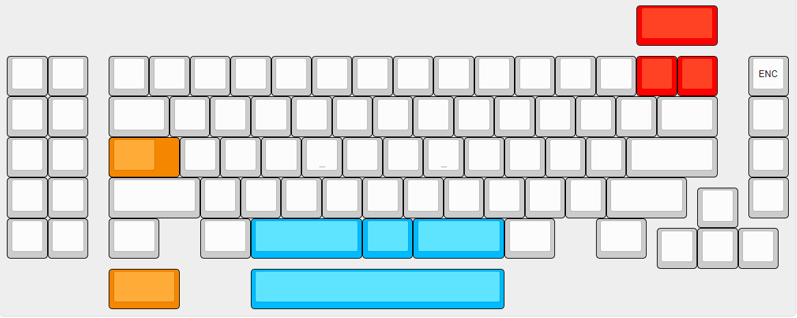

### I provide this keyboard without liability and without any guarantees regarding functionality, as expressed in the Creative Commons license under which all of these PCBs are licensed.

KiCad and Fusion360 files are included 

Tested Working on USB 2.0

QMK Can be found in my fork

# Supported Layouts

# Images
[Imgur Album](https://imgur.com/a/08Liv0p)

# Case
[M3 Spacers](https://www.mcmaster.com/94868a162) x 4 

[M3 Screws](https://www.mcmaster.com/93070a057) 1 pack 

Reccomended Manufacturers for cases: **Ponoko for Acrylic, SendCutSend for Metal** \n

Plate x 1 3mm Acrylic 

Midlayer x 2 3mm Acrylic 

Backplate x 1 3mm Acrylic 

*Note if using an aluminum plate use O-rings as a spacer

# QMK
[Keyboard](https://github.com/swiftrax/qmk_firmware/tree/master/keyboards/frogdor)

`make frogdor:default`
